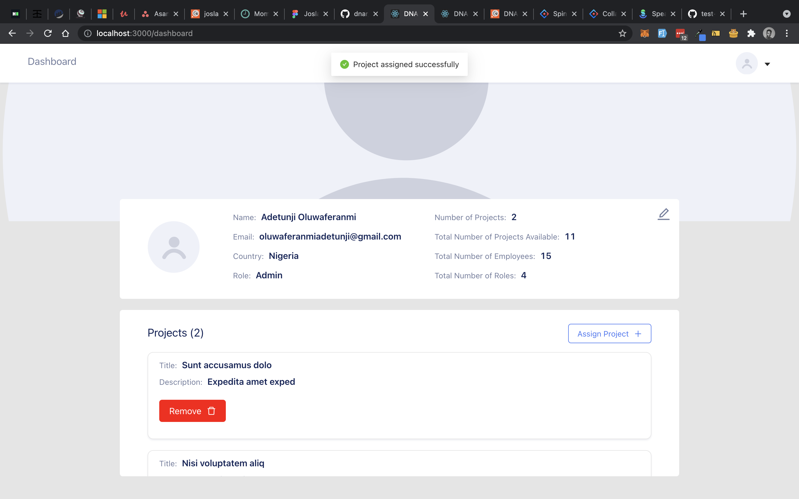

<p align="center">
 
  <h3 align="center">DNAR Frontend</h3>

  <p align="center">
    A Single Page Application for basic CRUD functions
    <br />
    <br />
    <a href="https://dnar.netlify.app/">View Demo</a>
    ·
    <a href="https://github.com/oluwaferanmiadetunji/dnar-frontend/issues">Report Bug</a>
    ·
    <a href="https://github.com/oluwaferanmiadetunji/dnar-frontend/issues">Request Feature</a>
  </p>
</p>

<!-- TABLE OF CONTENTS -->

## Table of Contents

-   [About the Project](#about-the-project)
    -   [Built With](#built-with)
-   [Getting Started](#getting-started)
    -   [Prerequisites](#prerequisites)
    -   [Installation](#installation)
    -   [Starting](#starting)
-   [Contributing](#contributing)
-   [License](#license)
-   [Contact](#contact)

<!-- ABOUT THE PROJECT -->

## About The Project

 A Single Page Application for basic CRUD functions

[](https://dnar.netlify.app)

### Built With

-   [React](https://reactjs.org/)
-   [React Redux](https://react-redux.js.org/)
-   [Ant Design](https://ant.design/)

<!-- GETTING STARTED -->

## Getting Started

To get a local copy up and running follow these simple steps.<br/><br/>

### Installation

1. Clone the repo

```sh
git clone https://github.com/oluwaferanmiadetunji/dnar-frontend.git
```

2. Install NPM packages

```sh
npm install
```

or

```sh
yarn
```

### Starting

Run

```sh
yarn start
```

in the root of the application
<br/>
<br/>

### Testing

<!-- CONTRIBUTING -->

## Contributing

<!--
Contributions are what make the open source community such an amazing place to be learn, inspire, and create. Any contributions you make are **greatly appreciated**.
-->

1. Fork the Project
2. Create your Feature Branch (`git checkout -b feature/name/AmazingFeature`)
3. Commit your Changes (`git commit -m 'Add some AmazingFeature`)
4. Push to the Branch (`git push origin feature/AmazingFeature`)
5. Open a Pull Request

## License

Distributed under the MIT License. See `LICENSE` for more information.

<!-- CONTACT -->

## Contact

Adetunji Oluwaferanmi - oluwaferanmiadetunji@gmail.com
